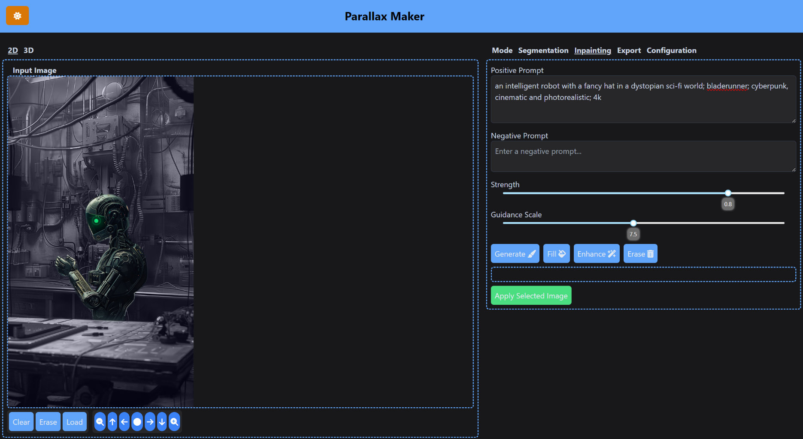
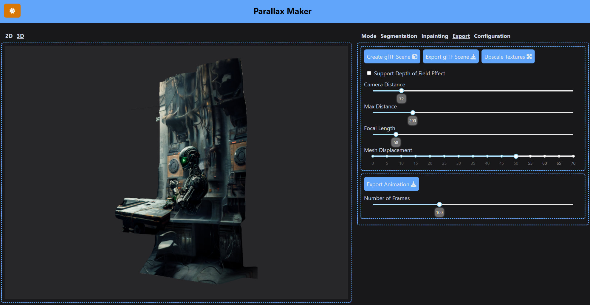
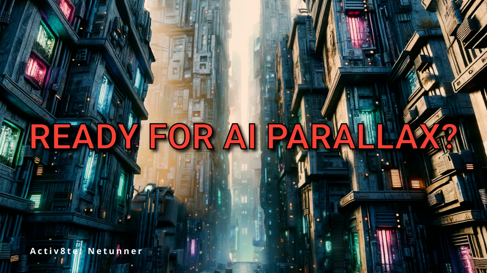
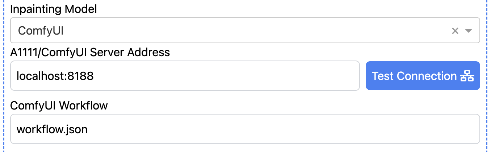

# Installation and First Usage

Create a new environment with python 3.10 via *conda* or *venv* and then use pip to install the dependencies.
```
$ pip install -r requirements.txt
$ python ./webui.py
```

You can then reach the web ui via [http://127.0.0.1:8050/](http://127.0.0.1:8050/). Be prepared that the first time, any new functionality is used, the corresponding models need to be downloaded first. This can take a few minutes based on your connection speed. If you want to prefetch the default models, you can start the application with
```
$ python ./webui.py --prefetch-models=default
```


# Parallax-Maker

Generates masked images that can be used for 2.5D animation

Using an input image, the tool runs a depth model like Midas to generate a depth map

 

and then creates cards that can be used for 2.5 parallax animation.


This animation was created using the following command:

~~~
ffmpeg -framerate 24 -i rendered_image_%03d.png -filter_complex "fps=5,scale=480:-1:flags=lanczos,split[s0][s1];[s0]palettegen=max_colors=32[p];[s1][p]paletteuse=dither=bayer" output.gif 
~~~


# 3D Export

The tool also supports generating a glTF2.0 scene file that an be easily imported into 3D apps like Blender. To utilize depth of field camera effects for the Blender scene, the material needs to be changed to **ALPHA HASHED**.


# Web UI



A simple Dash based Web UI provides a browser assisted workflow to generated slices from images, inpaint the slices and then export them as a glTF scene to Blender. The resulting glTF scene can also be visualized within the app or manipulated via a command line tool and the state file saved by the app



# Watch the Video
[](https://www.youtube.com/watch?v=4JBQCz-wWYQ)

# Advanced Use Cases
Parallax Maker also supports the Automatic1111 and ComfyUI API endpoints. This allows the tool to utilize GPUs remotely and potentially achieve much higher performance compared to the local GPU. It also means that it's possible to use more specialzied inpainting models and workflows. Here is [an example](example/workflow.json) ComfyUI inpainting workflow that makes use the offset lora published by Stability AI.

