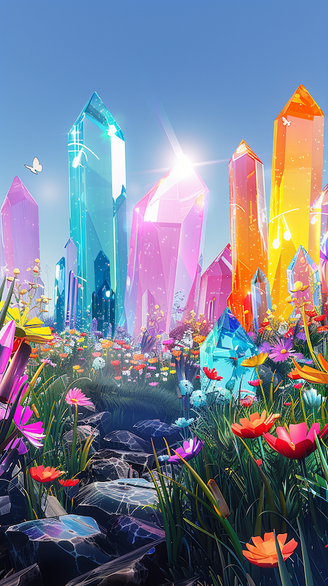
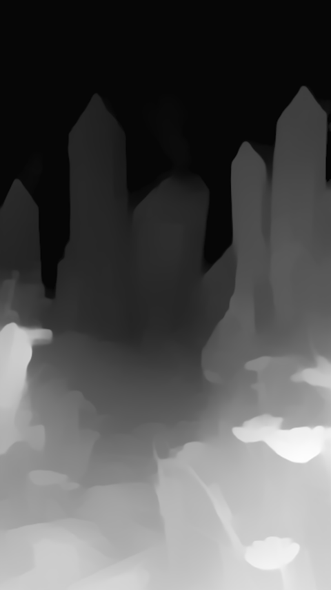
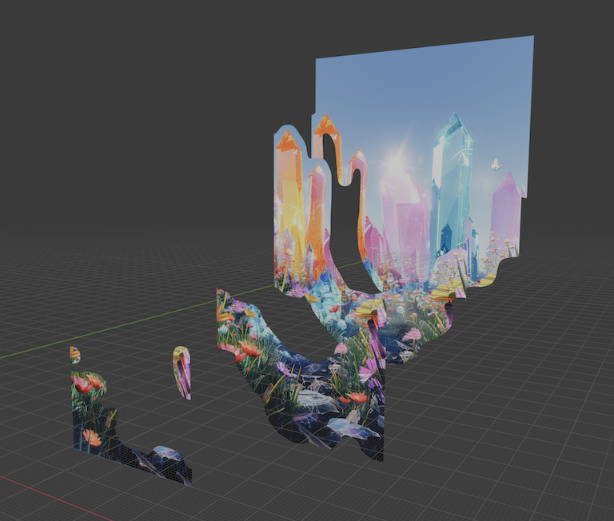

# installation

Via pip use
```
$ pip install -r requirements.txt
```

# parallax-maker

Generates masked images that can be used for 2.5D animation

Using an input image, the tool runs a depth model like Midas to generate a depth map

 

and then creates cards that can be used for 2.5 parallax animation.


This animation was created using the following command:

~~~
ffmpeg -framerate 24 -i rendered_image_%03d.png -filter_complex "fps=5,scale=480:-1:flags=lanczos,split[s0][s1];[s0]palettegen=max_colors=32[p];[s1][p]paletteuse=dither=bayer" output.gif 
~~~


# 3D Export

The tool also supports generating a glTF2.0 scene file that an be easily imported into 3D apps like Blender.

